#  Terraform AWS Infrastructure as Code (IaC)

Provision and deploy a Dockerized application on an AWS EC2 instance using **Terraform** and **EC2 User Data**, enabling fully automated infrastructure provisioning and application deployment.

<p align="left">


</p>

---

# 🏗️ Architecture

<p align="center">
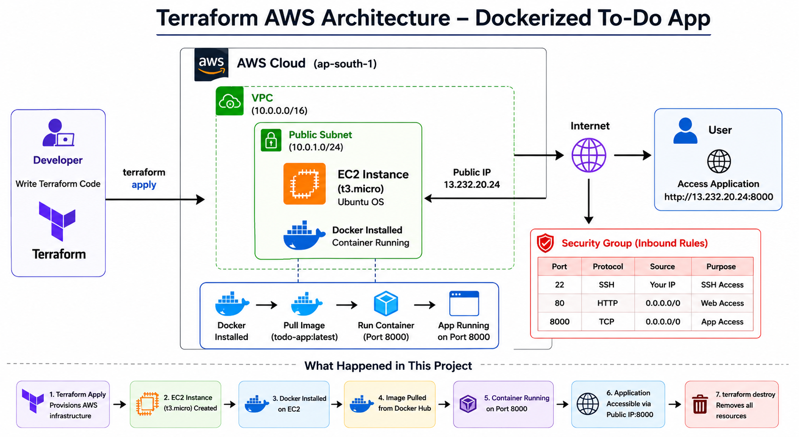
</p>

<p align="center">
<b>Figure 1.</b> Terraform provisions an AWS EC2 instance, executes the User Data script, installs Docker, pulls the application image from Docker Hub, and deploys the container automatically.
</p>

---

# 📌 Features

- Infrastructure as Code (IaC) using Terraform
- Automatic EC2 provisioning on AWS
- Automated Docker installation using EC2 User Data
- Automatic Docker image pull from Docker Hub
- Automatic container deployment during instance launch
- Security Group configuration for SSH and application access
- One-command infrastructure provisioning (`terraform apply`)
- One-command infrastructure cleanup (`terraform destroy`)

---

# 🛠️ Tech Stack

| Technology | Purpose |
|------------|---------|
| Terraform | Infrastructure as Code |
| AWS EC2 | Compute Service |
| Ubuntu | Operating System |
| Docker | Container Runtime |
| Docker Hub | Container Image Registry |
| EC2 User Data | Automated Instance Configuration |
| Git | Version Control |
| GitHub | Source Code Hosting |

---

# 🚀 Deployment Workflow

## Step 1 — Initialize Terraform

Downloads the required provider plugins.

```bash
terraform init
```

<p align="center">
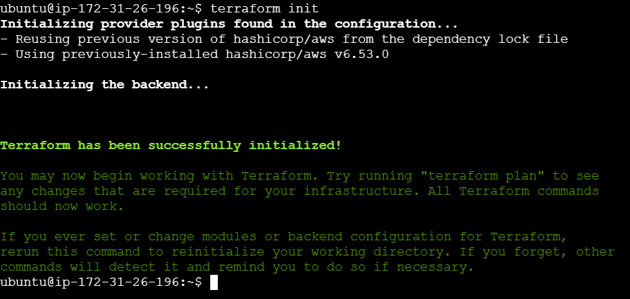
</p>

<p align="center">
<b>Figure 2.</b> Terraform initializes the working directory and downloads the required AWS provider plugins.
</p>

---

## Step 2 — Validate Configuration

Checks the Terraform configuration for syntax errors.

```bash
terraform validate
```

<p align="center">
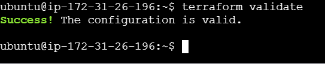
</p>

<p align="center">
<b>Figure 3.</b> Terraform validates the configuration successfully.
</p>

---

## Step 3 — Review Execution Plan

Displays the infrastructure changes before deployment.

```bash
terraform plan
```

<p align="center">
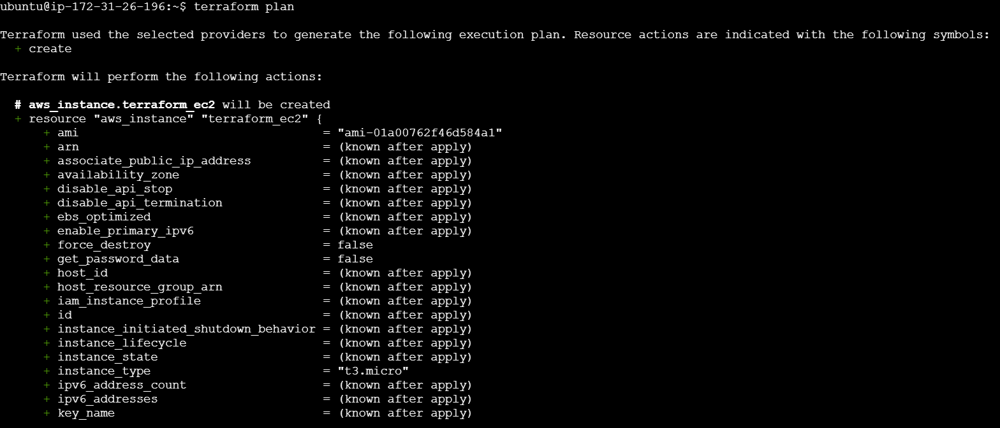
</p>

<p align="center">
<b>Figure 4.</b> Terraform execution plan showing the resources that will be created.
</p>

---

## Step 4 — Terraform Configuration

Infrastructure configuration including AWS Provider, EC2 Instance, Tags and User Data.

<p align="center">
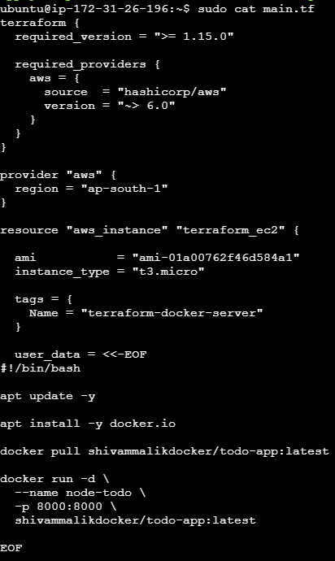
</p>

<p align="center">
<b>Figure 5.</b> Terraform configuration defining the EC2 instance and automated deployment using User Data.
</p>

---

## Step 5 — Provision AWS Infrastructure

Creates the EC2 instance and automatically executes the User Data script.

```bash
terraform apply
```

<p align="center">
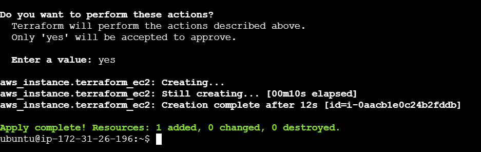
</p>

<p align="center">
<b>Figure 6.</b> Terraform successfully provisions the AWS EC2 instance.
</p>

---

## Step 6 — EC2 Instance Created

Terraform successfully provisions the EC2 instance on AWS.

<p align="center">
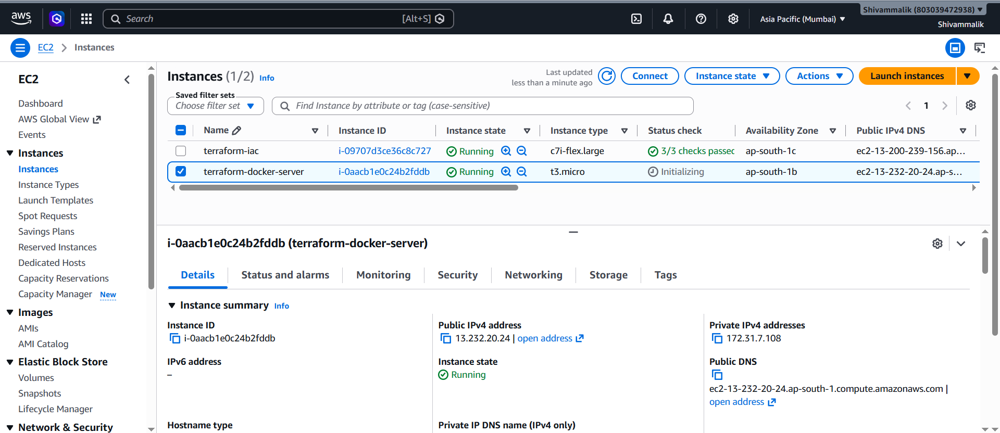
</p>

<p align="center">
<b>Figure 7.</b> AWS Console showing the newly created EC2 instance.
</p>

---

## Step 7 — Docker Container Running

The User Data script automatically installs Docker, pulls the Docker image and starts the container.

<p align="center">
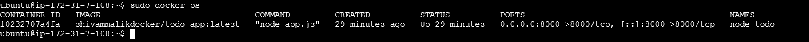
</p>

<p align="center">
<b>Figure 8.</b> Docker container running successfully after pulling the image from Docker Hub.
</p>

---

## Step 8 — Security Group Configuration

Inbound rules configured for SSH (22) and Application Port (8000).

<p align="center">
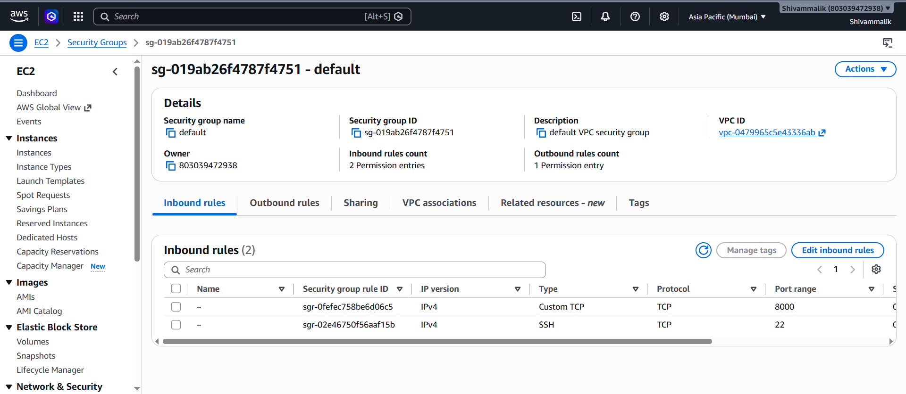
</p>

<p align="center">
<b>Figure 9.</b> Security Group allowing SSH and application traffic.
</p>

---

## Step 9 — Application Running

Application successfully deployed and accessible using the EC2 Public IP.

```
http://<EC2-Public-IP>:8000/todo
```

<p align="center">
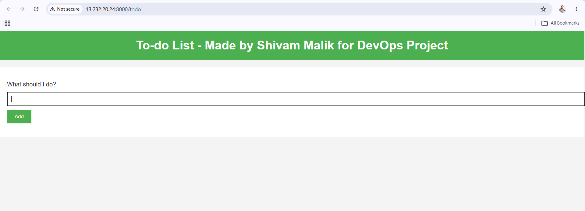
</p>

<p align="center">
<b>Figure 10.</b> Dockerized To-Do application running successfully on the EC2 instance.
</p>

---

## Step 10 — Destroy Infrastructure

Removes all AWS resources managed by Terraform.

```bash
terraform destroy
```

<p align="center">
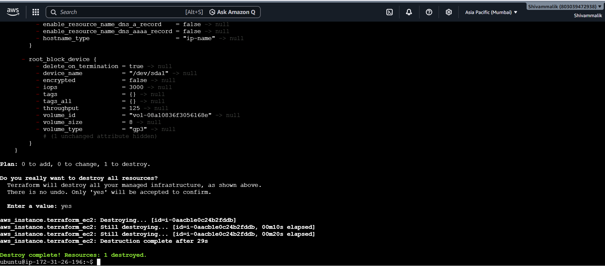
</p>

<p align="center">
<b>Figure 11.</b> Terraform successfully destroys all provisioned AWS resources.
</p>

---

# ▶️ How to Run

Clone the repository.

```bash
git clone https://github.com/Shivam-Malik-Dev/terraform-aws-iac.git
```

Move to the project directory.

```bash
cd terraform-aws-iac/terraform
```

Initialize Terraform.

```bash
terraform init
```

Validate configuration.

```bash
terraform validate
```

Preview infrastructure changes.

```bash
terraform plan
```

Provision the infrastructure.

```bash
terraform apply
```

Open the application.

```
http://<EC2-Public-IP>:8000/todo
```

Destroy all resources.

```bash
terraform destroy
```

---

# 📖 Terraform Commands

| Command | Description |
|----------|-------------|
| `terraform init` | Initialize Terraform |
| `terraform validate` | Validate Terraform configuration |
| `terraform plan` | Preview infrastructure changes |
| `terraform apply` | Provision AWS infrastructure |
| `terraform destroy` | Destroy all managed resources |

---

# 📈 Future Improvements

- Create a custom VPC using Terraform
- Create Security Groups using Terraform
- Use Variables (`variables.tf`)
- Use Outputs (`outputs.tf`)
- Modularize the Terraform configuration
- Configure Remote Backend (Amazon S3)
- Enable State Locking using DynamoDB
- Provision IAM Roles using Terraform
- Deploy behind an Application Load Balancer
- Configure Auto Scaling Group
- Integrate CI/CD using GitHub Actions

---

# 👨‍💻 Author

**Shivam Malik**

**GitHub:**  
https://github.com/Shivam-Malik-Dev

**LinkedIn:**  
https://www.linkedin.com/in/shivam-malik-59b13a29b/